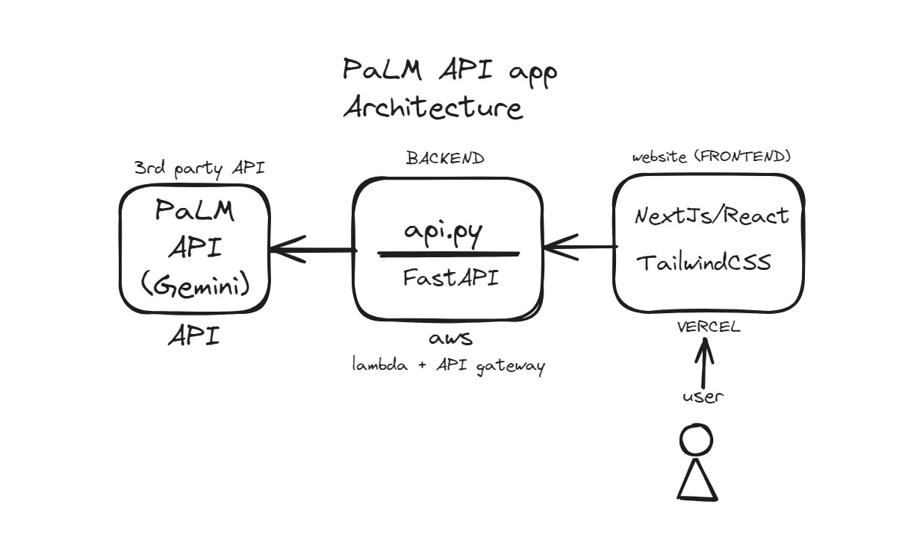

# Bard API Fullstack SaaS

React | FastAPI | AWS Lambda | Vercel

Just a project I did to get comfortable with the above techstack

## Description

This project uses AI to generate branding snippets and keywords for the customer's brand.

## App Architecture
Here's a visual representation of the app's architecture to give you an idea on how it works.

Try it out here -> https://bard-branding-gen.vercel.app/
